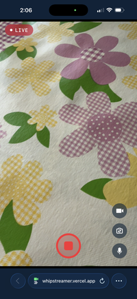
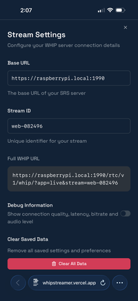

# WHIP Streamer

A modern, web-based streaming client using the WHIP (WebRTC-HTTP ingestion
protocol) standard. Built with React, Vite, and Tailwind CSS.

## Features

- **WHIP Support**: Stream directly to any WHIP-compatible server (like SRS,
  Janus, or Mediasoup).
- **Camera controls**: Switch between front/back cameras, flip, and zoom.
- **Pinch-to-zoom**: Native-like pinch zoom support.
- **Audio/video toggle**: Mute audio or disable video on the fly.
- **Connection stats**: Real-time debug overlay with bitrate, latency, and
  packet loss info.
- **Responsive design**: Works on mobile, tablet, and desktop.

  
  

## Tech Stack

- **Frontend**: React, TypeScript, Vite
- **Styling**: Tailwind CSS, Framer Motion
- **Icons**: Phosphor Icons
- **Protocol**: WHIP (WebRTC)
